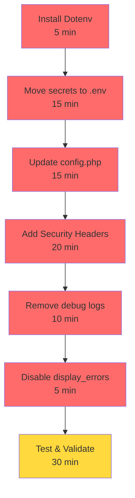

# 📊 RÉSUMÉ EXÉCUTIF - Audit de Sécurité

**Score global : 3.5/10** 🔴  
**Vulnérabilités critiques : 7**  
**Vulnérabilités hautes : 4**  

---

## 🎯 VUE D'ENSEMBLE RISQUES

```
CRITIQUE (Corriger immédiatement)
├─ 🔴 Secrets hardcodés dans config.php
├─ 🔴 Pas d'en-têtes de sécurité (CSP, X-Frame, etc.)
├─ 🔴 Display errors activé (information disclosure)
├─ 🔴 Logs sensibles non filtrés
└─ 🔴 Contrôle d'accès incomplet

ÉLEVÉ (Corriger cette semaine)
├─ 🟠 Validation d'entrées insuffisante
├─ 🟠 Sessions non sécurisées
├─ 🟠 Pas de CSRF tokens
└─ 🟠 Rate limiting absent sur login

MOYEN
├─ 🟡 Timeouts de session non configurés
├─ 🟡 Logs pas rotatés
└─ 🟡 Pas de monitoring sécurité

✅ BON
├─ ✓ SQL Injection: Protégé (prepared statements)
├─ ✓ Path Traversal: Sécurisé (pas d'upload)
└─ ✓ Password hashing: bcrypt correct
```

---

## 📋 MATRICE DÉTAILLÉE

| # | Vulnérabilité | Fichier | Risque | Impact | Délai |
|---|---|---|---|---|---|
| **1** | **Hardcoded Credentials** | config.php, oauth, oneroster, webService | 🔴 CRITIQUE | Accès BD/APIs | 1h |
| **2** | **Pas d'en-têtes sécurité** | public/index.php | 🔴 CRITIQUE | XSS, Clickjacking, MITM | 30min |
| **3** | **Display errors ON** | public/index.php | 🔴 CRITIQUE | Information disclosure | 5min |
| **4** | **Logs sensibles** | authController, usersModel | 🔴 CRITIQUE | Credentials exposées | 15min |
| **5** | **Autorisation incomplète** | searchController, studentsController | 🟠 ÉLEVÉ | Accès transversal | 2h |
| **6** | **Validation entrées** | searchController, absenceController | 🟠 ÉLEVÉ | Injection/DoS | 3h |
| **7** | **Session insécurisée** | public/index.php | 🟠 ÉLEVÉ | Session hijacking | 1h |
| **8** | **Pas de CSRF tokens** | router.php, API | 🟡 MOYEN | CSRF (limité en JSON) | 2h |

---

## 🚀 PLAN DE REMÉDIATION

### **PHASE 1 : URGENT** (< 4 heures)



**Actions :**
1. ✅ Installer composer require vlucas/phpdotenv
2. ✅ Créer app/config/.env avec secrets
3. ✅ Modifier 4 fichiers config.php
4. ✅ Ajouter 10 headers de sécurité dans public/index.php
5. ✅ Supprimer 2 error_log() sensibles
6. ✅ Mettre ini_set display_errors = 0
7. ✅ Tester : curl -I, login, erreur

**Fichiers à éditer : 7**  
**Lignes de code : ~80**  
**Validation : ~30 min**

---

### **PHASE 2 : TRÈS IMPORTANT** (cette semaine)

```
Créer AuthService.php pour requireRole()
├─ classesController::delete() → Gestionnaire seulement
├─ matieresController::delete() → Gestionnaire seulement
├─ usersController::* → Gestionnaire seulement
└─ schedulesController::* → Gestionnaire seulement

Créer ValidationService.php
├─ searchController::search() → validateString
├─ absenceController → validateDate
└─ scanController → validateUUID

Configurer session sécurisée
├─ session.cookie_httponly = 1
├─ session.cookie_samesite = Lax
└─ session.gc_maxlifetime = 3600
```

**Temps :** ~6 heures  
**Tests :** Vérifier autorisation + validation

---

### **PHASE 3 : IMPORTANT** (2-4 semaines)

```
Implémenter CSRF tokens
├─ CsrfService.php (generate/verify)
├─ router.php (verify pour POST/PUT/DELETE)
└─ API calls (ajouter X-CSRF-Token header)

Ajouter rate limiting
├─ Login: max 5 tentatives / 15 min
├─ API: max 100 req / min par IP
└─ Monitoring: logger tentatives refusées

Configurer logs rotation
├─ app/logs/*.log < 10MB
├─ Archiver après 30j
└─ Pas de credentials en logs

Audit de permissions
└─ Qui peut voir/modifier quoi ?
```

---

## 🔍 CHECKLIST DÉTAILLÉE

### PHASE 1 IMMÉDIATE (Faire AUJOURD'HUI)

```
SECRETS & CONFIGURATION
[ ] Installer vlucas/phpdotenv via composer
[ ] Créer .env.example avec placeholders
[ ] Créer .env avec vraies valeurs (CONFIDENTIEL)
[ ] Modifier .gitignore (ajouter /.env)
[ ] Mettre à jour config.php avec Dotenv::load()
[ ] Mettre à jour oauth_credentials.php (charger .env)
[ ] Mettre à jour oneroster.php (charger .env)
[ ] Mettre à jour webService.php (charger .env)

EN-TÊTES SÉCURITÉ
[ ] Ajouter X-XSS-Protection header
[ ] Ajouter X-Content-Type-Options header
[ ] Ajouter X-Frame-Options header
[ ] Ajouter Content-Security-Policy header
[ ] Ajouter Referrer-Policy header
[ ] Ajouter Permissions-Policy header

CONFIGURATION
[ ] Mettre ini_set display_errors = 0
[ ] Configurer session.cookie_httponly = 1
[ ] Configurer session.cookie_samesite = Lax
[ ] Configurer session.gc_maxlifetime = 3600
[ ] Configurer error_log path = app/logs/php-errors.log

NETTOYAGE LOGS
[ ] Supprimer error_log('Login input:...') dans authController
[ ] Supprimer error_log('password_verify:...') dans usersModel
[ ] Vérifier aucun autre log sensible

TESTS
[ ] Tester login (doit fonctionner)
[ ] curl -I http://127.0.0.1:8000/ (vérifier headers)
[ ] Tester sans session (doit être 401)
[ ] Vérifier app/logs/php-errors.log (pas de credentials)
```

### PHASE 2 (CETTE SEMAINE)

```
AUTORISATION
[ ] Créer app/service/AuthService.php
[ ] Ajouter requireRole() dans classesController
[ ] Ajouter requireRole() dans matieresController
[ ] Ajouter requireRole() dans usersController
[ ] Tester accès refusé (403) pour rôle insuffisant

VALIDATION
[ ] Créer app/service/ValidationService.php
[ ] Valider $_GET['q'] dans searchController
[ ] Valider dates dans absenceController
[ ] Valider UUID dans scanController
[ ] Tester avec payload malveillant

SESSIONS
[ ] Vérifier session_regenerate_id() après login
[ ] Tester session timeout
[ ] Vérifier cookie_httponly empêche JS
```

### PHASE 3 (2-4 SEMAINES)

```
CSRF
[ ] Créer CsrfService.php
[ ] Implémenter dans router.php
[ ] Tester X-CSRF-Token header

MONITORING
[ ] Configurer log rotation
[ ] Ajouter alertes tentatives login échouées
[ ] Monitorer accès refusés (403)

AUDIT CONTINU
[ ] Monthly: Vérifier aucun hardcoded secret
[ ] Monthly: Vérifier logs pour data sensible
[ ] Quarterly: Réévaluer sécurité
```

---

## 📈 PROGRESSION ATTENDUE

| Après Phase | Score | État |
|---|---|---|
| Actuel | 3.5/10 | 🔴 Critique |
| Phase 1 (Jour 1) | 6.5/10 | 🟠 Élevé (acceptable réseau local) |
| Phase 2 (Semaine 1) | 7.5/10 | 🟠 Élevé |
| Phase 3 (Mois 1) | 8.5/10 | 🟡 Moyen |
| Phase 4 (Audit) | 9.0/10 | 🟢 Bon |

---

## 📞 RESSOURCES

- **Rapport détaillé :** `AUDIT_SECURITE_COMPLET.md`
- **Plan action :** `REMEDIATATION_IMMEDIATEMENT.md`
- **Codebase :** Tous fichiers config, controller, app/service/

---

## ⚠️ POINTS CRITIQUES

1. **Avant mise en production :** Phase 1 + 2 OBLIGATOIRE
2. **Réseau local :** Phase 1 IMMÉDIAT, Phase 2-3 dans délais
3. **Backup secrets :** Sauvegarder .env en lieu sûr
4. **Rotation secrets :** Changer credentials régulièrement
5. **Monitoring :** Activer logs et alertes sécurité

---

**Préparé le :** 11 mai 2026  
**Validité :** 3 mois (réévaluation recommandée)  
**Scope :** Application sortie_ecole - Réseau local
