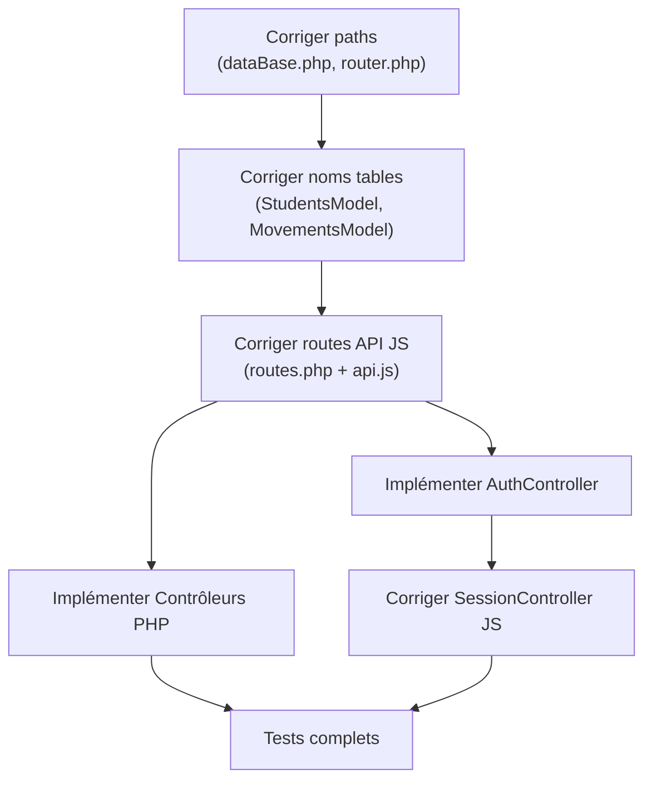

# RÉSUMÉ EXÉCUTIF - Bugs & Actions Requises

---

## 🚨 BUGS CRITIQUES (Blockers - Jour 1)

### 1. Incohérence Noms Tables (P1 - Bloquant Total)

| Aspect | Problème | Fichiers | Status |
|--------|---------|----------|--------|
| **Tables BD** | SQL crée `etudiants`, `passages`, `utilisateurs` | [Creation DB-Tables sortie_ecole.sql](Creation%20DB-Tables%20sortie_ecole.sql) | ❌ |
| **Entity Students** | PHP cherche `students` au lieu d'`etudiants` | [app/model/studentsModel.php#L12](app/model/studentsModel.php) | ❌ |
| **Entity Movements** | PHP cherche `movements` au lieu d'`passages` | [app/model/movementsModel.php#L19](app/model/movementsModel.php) | ❌ |
| **Colonnes BD** | Frontend envoie `student_id` / BD attend `id_etudiant` | Partout | ❌ |
| **Types Movement** | Frontend envoie `entry` / BD attend `entree_matin` ENUM | [BDD schema](Creation%20DB-Tables%20sortie_ecole.sql) | ❌ |

**Action:** Corriger tous les noms (voir [SOLUTIONS_CODE.md](SOLUTIONS_CODE.md#1️⃣-correction-noms-de-tables-critique))

**Temps Estimé:** 30 min

---

### 2. Chemin Configuration Incorrect (P1 - Bloquant)

| Élément | Problème | Fichier | Line |
|---------|---------|---------|------|
| Configuration PHP | `__DIR__ . '../config/config.php'` ❌ | [app/core/dataBase.php](app/core/dataBase.php) | 12 |
| **Correct** | `__DIR__ . '/../config/config.php'` ✅ | - | - |

**Impact:** Classe DataBase ne peut charger la configuration → La connexion échoue

**Action:** Ajouter le `/` manquant

**Temps Estimé:** 5 min

---

### 3. Namespace Routeur Faux (P1 - Bloquant)

| Élément | Problème | Fichier | Line |
|---------|---------|---------|------|
| Namespace recherchée | `App\\Controllers\\ScanController` ❌ | [app/core/router.php](app/core/router.php) | 36 |
| **Correct** | `App\\Controller\\ScanController` ✅ | - | - |
| Dossier réel | `app/controller/` (sans 's') | - | - |

**Impact:** Routeur ne trouvera aucun contrôleur → 404 sur toutes les routes

**Action:** Changer `Controllers` → `Controller`

**Temps Estimé:** 5 min

---

### 4. Routes API Incohérentes (P1 - Bloquant)

| Source | Appelle | Existe? | Note |
|--------|---------|---------|------|
| movementsModel.js | `php/api/addMovement.php` | ❌ Non | Fichier n'existe pas |
| movementsModel.js | `php/api/searchMovements.php` | ❌ Non | Fichier n'existe pas |
| studentsModel.js | `php/api/searchStudents.php` | ❌ Non | Fichier n'existe pas |
| usersModel.js | `php/api/addUser.php` | ❌ Non | Fichier n'existe pas |
| usersModel.js | `php/api/deleteUser.php` | ❌ Non | Fichier n'existe pas |
| usersModel.js | `php/api/updateUser.php` | ❌ Non | Fichier n'existe pas |
| scanController.js | `/scan/ajouter` | ✅ Oui | Route du routeur (fonctionne) |

**Action:** Unifier sur le routeur PHP (voir [SOLUTIONS_CODE.md#2️⃣-correction-routes-api-incohérentes](SOLUTIONS_CODE.md#2%EF%B8%8F⃣-correction-routes-api-incohérentes))

**Temps Estimé:** 2 heures

---

## ⚠️ FICHIERS INCOMPLETS/MANQUANTS

### A. Contrôleurs PHP Vides (À Implémenter)

| Fichier | État | À Faire | Temps |
|---------|------|---------|-------|
| [app/controller/dashboardController.php](app/controller/dashboardController.php) | Namespace seul | Implémenter `index()` | 1h |
| [app/controller/gestionController.php](app/controller/gestionController.php) | Namespace seul | Implémenter `index()`, `ajouter()` | 1h |
| [app/controller/searchController.php](app/controller/searchController.php) | Namespace seul | Implémenter `search()` | 1h |
| [app/controller/absentController.php](app/controller/absentController.php) | Namespace seul | Implémenter `index()` | 1h |
| [app/controller/historicalController.php](app/controller/historicalController.php) | Namespace seul | Implémenter `show()` | 1.5h |

### B. Contrôleurs Manquants Complètement

| Fichier | Raison | À Faire | Temps |
|---------|--------|---------|-------|
| `app/controller/AuthController.php` | Référencé dans routes.php | Créer (voir [SOLUTIONS_CODE.md#4️⃣](SOLUTIONS_CODE.md#4%EF%B8%8F⃣-correction-authcontrollerphp-manquant)) | 1.5h |
| `app/controller/HomeController.php` | Référencé dans routes.php | Créer avec `index()` | 0.5h |
| `app/controller/MovementsController.php` | Nouvelles routes API | Créer | 1.5h |
| `app/controller/UsersController.php` | Nouvelles routes API | Créer | 1.5h |

### C. Couche API Centralisée Manquante

| Fichier | État | À Faire | Temps |
|---------|------|---------|-------|
| [public/js/api.js](public/js/api.js) | ❌ Vide | Créer classe Api (voir [SOLUTIONS_CODE.md#2️⃣](SOLUTIONS_CODE.md#2%EF%B8%8F⃣-correction-routes-api-incohérentes)) | 1.5h |

---

## 📊 TABLEAU DE PRIORITÉ COMPLÈTE

### Jour 1 - IMMÉDIAT (Blockers, ~1h45)

```
1. [5 min]  Corriger dataBase.php ligne 12      ← Erreur chemin
2. [5 min]  Corriger router.php ligne 36        ← Namespace faux
3. [30 min] Corriger noms tables tous modèles    ← Incohérence BD
4. [5 min]  Corriger scanController.php ligne 18 ← Syntaxe
5. [15 min] Corriger paramètres API              ← Mappage student_id/id_etudiant
```

**Résultat:** Le routeur fonctionne, les tables correspondent

---

### Jour 2 - COURT TERME (Routes API, ~2h)

```
1. [1.5h] Ajouter routes dans routes.php
2. [1.5h] Créer api.js centralisée
3. [30 min] Mettre à jour movementsModel.js pour utiliser API
4. [30 min] Mettre à jour studentsModel.js pour utiliser API
5. [30 min] Mettre à jour usersModel.js pour utiliser API
```

**Résultat:** Toutes les requêtes frontend passent par le routeur PHP

---

### Jour 3 - IMPLÉMENTATIONS (Contrôleurs, ~6h)

```
Contrôleurs à Implémenter:
1. [1.5h] AuthController.php ← Authentification (vue SOLUTIONS_CODE.md)
2. [1.5h] SearchController.php ← Recherche étudiants
3. [1.5h] MovementsController.php ← Gestion mouvements
4. [1.5h] UsersController.php ← Gestion utilisateurs
5. [1h]   DashboardController.php ← Dashboard
6. [30 min] HomeController.php ← Page d'accueil
```

**Résultat:** Tous les endpoints backend fonctionnels

---

### Jour 4 - AUTHENTIFICATION (Sessions, ~2h)

```
1. [1.5h] Corriger sessionController.js pour appeler /login
2. [30 min] Tester cycle login/logout
3. [30 min] Vérifier sessions PHP côté serveur
```

**Résultat:** Authentification sécurisée via backend

---

### Jour 5 - TESTS & POLISH (~3h)

```
Cas de test:
1. [30 min] Créer compte utilisateur (/gestion/ajouter)
2. [30 min] Scanner étudiant (/scan/ajouter)
3. [30 min] Rechercher étudiant (/students/search)
4. [30 min] Afficher historique étudiant (/historical/{id})
5. [30 min] Gestion absences (/absent)
6. [30 min] Dashboard (/dashboard)
```

**Résultat:** Système fonctionnel complètement

---

## 📋 FICHIERS À CORRIGER - ORDER

### Ordre Recommandé Pour Corrections

```
STEP 1: Configuration/Paths (5 min)
├─ app/core/dataBase.php:12
└─ app/core/router.php:36

STEP 2: Base de Données Mappings (30 min)
├─ app/model/studentsModel.php
├─ app/model/movementsModel.php
└─ app/model/usersModel.php

STEP 3: Routes & API Gateway (2h)
├─ app/config/routes.php (ajouter routes)
├─ public/js/api.js (créer)
├─ public/js/model/movementsModel.js
├─ public/js/model/studentsModel.js
└─ public/js/model/usersModel.js

STEP 4: Backend Controllers (6h)
├─ app/controller/AuthController.php ⭐ PRIORITAIRE
├─ app/controller/SearchController.php
├─ app/controller/MovementsController.php
├─ app/controller/UsersController.php
├─ app/controller/homeController.php
└─ app/controller/historicalController.php

STEP 5: Frontend Sessions (1.5h)
└─ public/js/controller/sessionController.js

STEP 6: Testing (3h)
└─ Tester tous les endpoints
```

---

## 🎯 DÉPENDANCES ENTRE TÂCHES



---

## 💡 POINTS CLÉS DE CORRECTION

### ✅ À Faire

1. **Cartographie Complète:** Tableau mapping frontend → backend → BD
   - Frontend: `student_id` → PHP: `id_etudiant` → BD: `id_etudiant`
   - Frontend: `movement_type: 'entry'` → PHP: appelle `mapMovementType()` → BD: `type_passage: 'entree_matin'`

2. **Routeur Centralisé:** Utiliser UNIQUEMENT le routeur PHP
   - Pas de `php/api/...` (fichiers inexistants)
   - Toutes les routes dans `routes.php`
   - Toutes les API utilisent le routeur

3. **Gestion Erreurs:** Implémentation cohérente
   - Réponses JSON standardisées: `{success, message, results}`
   - Codes HTTP corrects: 200, 400, 401, 404, 500
   - Logs centralisées

4. **Authentification Sécurisée**
   - Backend valide, frontend ne peut pas contourner
   - SessionStorage OK (c'est juste du scope JS dans le contexte)
   - Utiliser JWT ou sessions PHP standard

---

## 📈 INDICATEURS DE PROGRESSION

| Milestone | Critère | État |
|-----------|---------|------|
| **DB Access** | Les requêtes SQL ne retournent plus "table not found" | ❌ |
| **Routes** | Routeur trouve tous les contrôleurs | ❌ |
| **API** | Toutes les requêtes fetch utilisent le routeur | ❌ |
| **Controllers** | Tous les contrôleurs implémentés | ❌ |
| **Auth** | Login/logout fonctionne via backend | ❌ |
| **Features** | Scan, recherche, historique, gestion: OK | ❌ |

---

## 📞 QUESTIONS À POSER AU PRODUCT OWNER

Avant de démarrer, clarifier:

1. **Architecture:** Voulez-vous une SPA (Single Page App) ou MVC traditionnel?
   - SPA: Frontend gère la navigation, backend = API REST pure JSON
   - MVC: Backend génère le HTML, frontend = simple interface

2. **Authentification:** Utiliser sessions PHP ou JWT?

3. **Frontend:** Les fichiers HTML statiques (`html/*.html`) sont-ils définitifs ou à générer par le backend?

4. **Performance:** Cache nécessaire? Pagination pour les grandes listes?

5. **Environnement:** Production utilise quel serveur? (IIS, Apache, Nginx?)

---

## ⏱️ TEMPS TOTAL ESTIMÉ

| Phase | Temps | Cumulé |
|-------|-------|--------|
| Corrections critiques (Jour 1) | 1h 45min | 1h 45min |
| Routes API (Jour 2) | 2h | 3h 45min |
| Contrôleurs PHP (Jour 3) | 6h | 9h 45min |
| Authentification (Jour 4) | 2h | 11h 45min |
| Tests & Polish (Jour 5) | 3h | 14h 45min |
| **TOTAL** | | **~15h** |

**Pour développeur senior:** ~15 heures  
**Pour développeur junior:** ~25-30 heures

---

## 📚 DOCUMENTS DE RÉFÉRENCE

1. **[RAPPORT_ANALYSE_BUGS.md](RAPPORT_ANALYSE_BUGS.md)** - Analyse détaillée complète
2. **[SOLUTIONS_CODE.md](SOLUTIONS_CODE.md)** - Code corrigé prêt à l'emploi
3. **[This File](RESUME_ACTIONS.md)** - Vue d'ensemble executive

